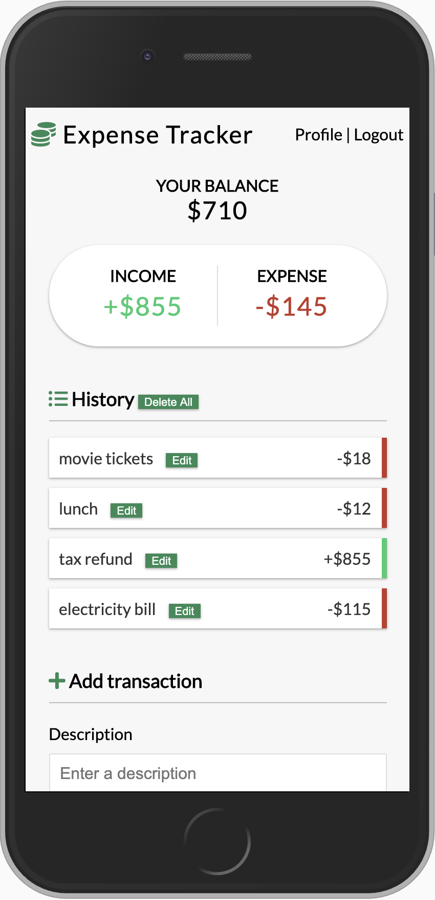

# Mobile Expense Tracker

A mobile web app to track your expenses. View a history of your past expenses. User authentication using JSON Web Token.



## Setup

To clone and run this application, you'll need [Git](https://git-scm.com/) and [Node.js](https://nodejs.org/) (which comes with [npm](https://www.npmjs.com/)) installed on your computer. From your command line:

```sh
# Clone this repository
$ git clone https://github.com/andyrutherford/expense-tracker.git

# Go into the repository
$ cd

# Install dependencies
$ npm install

# Create /config/config.env with the following variables:
$ MONGO_URI=<your-mongoDb-URI>
$ JWT_SECRET=<your-jwt-secret>

# Run the app
$ npm start
```

## Tech

- [ReactJS](https://reactjs.org/) - A JavaScript library for building user interfaces
- [node.js](http://nodejs.org) - evented I/O for the backend
- [Express](http://expressjs.com) - fast node.js network app framework
- [mongoDB](https://www.mongodb.com/) - general purpose, document-based, distributed database
- [mongoose](https://mongoosejs.com/) - MongoDB object modeling for Node.js
- [React Context API](https://reactjs.org/docs/context.html) - for state management
- [FontAwesome](https://fontawesome.com/) - for vector icons

## Demo

https://expense-tracker-2742.herokuapp.com/

## License

MIT
